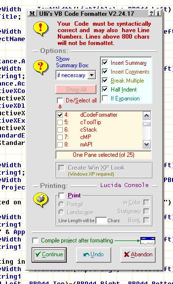



## Ulli's Code Formatter V2\.24\.17

### Description

This Visual Basic Add-In will format your code for a generally accepted indentation - one tab per structure level, the tab width being obtained from the IDE. It will also check your code for some of the most common ommissions and traps. Included are a Code Printer, a Copy Facility, a Code Structure Viewer and an option to create WinXP manifest files and to modify your code to make use of them.

Simply compile the DLL into your VB directory and then use the AddIns Manager to add it to the AddIns Menu. A few fixes and line number support. Download is 136 kB.
 
### More Info
 

             |
---                |---
**Submitted On**   |2008-04-09 17:40:04
**By**             |[ULLI](https://github.com/Planet-Source-Code/PSCIndex/blob/master/ByAuthor/ulli.md)
**Level**          |Advanced
**User Rating**    |5.0 (170 globes from 34 users)
**Compatibility**  |VB 6\.0
**Category**       |[VB function enhancement](https://github.com/Planet-Source-Code/PSCIndex/blob/master/ByCategory/vb-function-enhancement__1-25.md)
**World**          |[Visual Basic](https://github.com/Planet-Source-Code/PSCIndex/blob/master/ByWorld/visual-basic.md)
**Archive File**   |[Ulli's\_Cod2109154112008\.zip](https://github.com/Planet-Source-Code/ulli-ulli-s-code-formatter-v2-24-17__1-64016/archive/master.zip)

